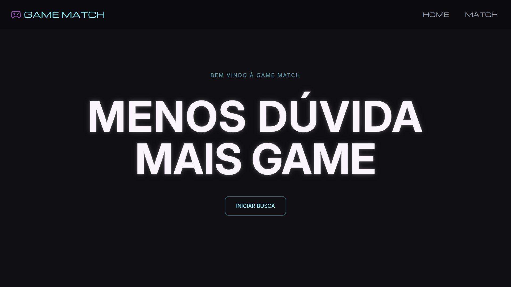
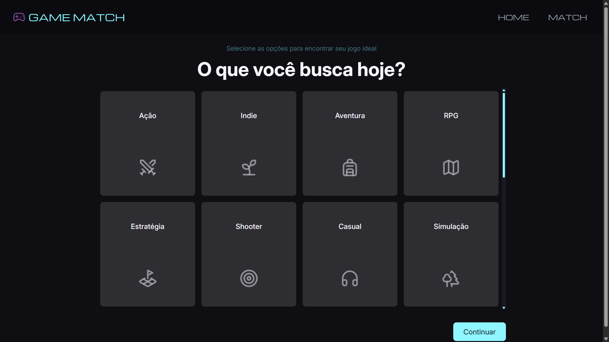
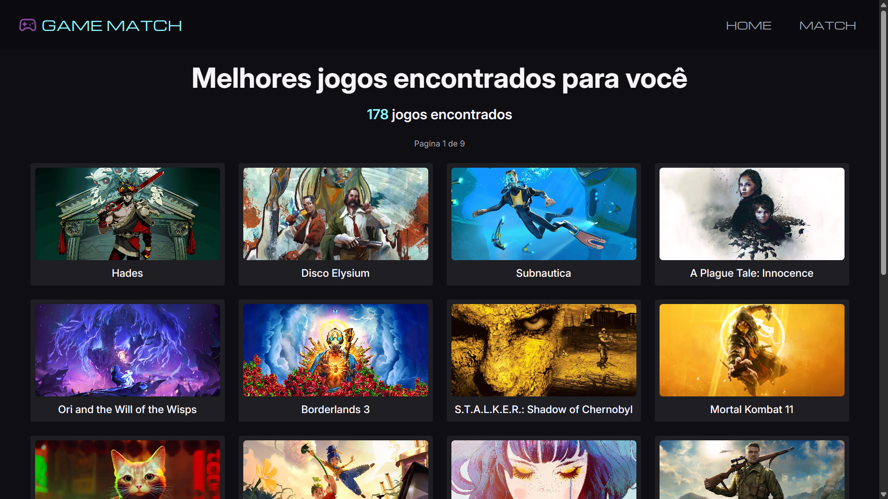
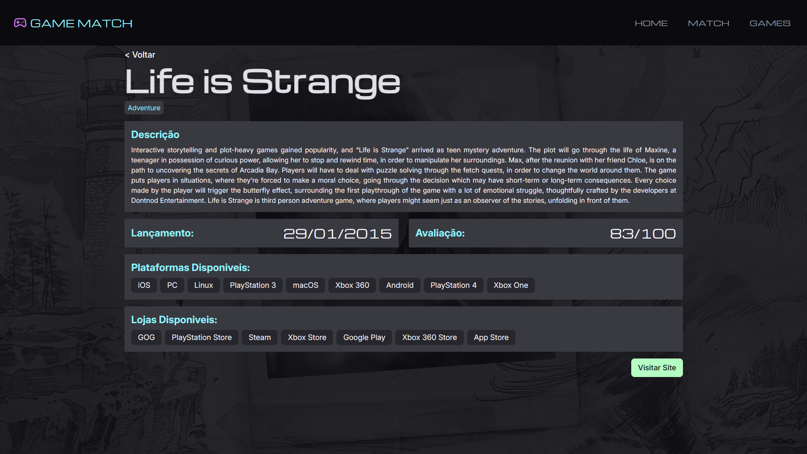
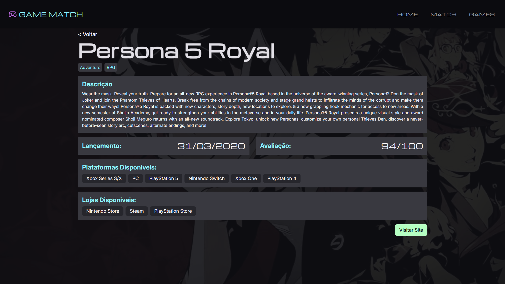

# Game Match

Aplicacao web para descoberta de jogos, com foco em pratica de Angular em um projeto academico mais proximo de um caso real.

## Deploy

Acesse a aplicacao publicada em:

https://game-match-ruddy.vercel.app/

## Sobre o projeto

O Game Match foi pensado para ajudar pessoas a encontrar jogos de forma mais pratica, explorando titulos por criterios como genero e outras preferencias.

Tambem e um projeto de estudo para consolidar conceitos importantes de frontend moderno com Angular.

## Objetivos de aprendizagem

- Estruturacao por features e componentes.
- Navegacao entre telas com roteamento.
- Consumo de APIs para listar e detalhar jogos.
- Captura e validacao de dados com formularios.
- Evolucao incremental de layout, UX e organizacao de codigo.

## Tecnologias

- Angular 21
- TypeScript
- Tailwind CSS
- RxJS
- Vercel (deploy)

## Como rodar localmente

### Pre-requisitos

- Node.js instalado (recomendado: versao LTS)
- npm

### Passos

1. Instale as dependencias:

```bash
npm install
```

2. Inicie o servidor de desenvolvimento:

```bash
npm start
```

3. Abra no navegador:

http://localhost:4200/

## Scripts disponiveis

- `npm start`: executa o projeto em modo desenvolvimento.
- `npm run build`: gera build de producao.
- `npm run watch`: build em modo observacao.
- `npm test`: executa os testes.
- `npm run format`: formata o codigo com Prettier.

## Estrutura base

```text
src/
	app/
		games/
			game-exibit/
			match/
				form/
				genre/
```

## Arquitetura da aplicacao

Desenho da arquitetura: em elaboracao.

## Fluxo da aplicacao (prints)

1. Home (entrada)



2. Filtro por preferencias



3. Resultado da busca (match de jogos)



4. Detalhe de jogo - exemplo 1



5. Detalhe de jogo - exemplo 2



## Status

Projeto finalizado.

## Autor

- Luciano Mazarao Jr
- Portfolio: https://game-match-ruddy.vercel.app/
- LinkedIn: http://www.linkedin.com/in/lucianomazaraojr
- Projeto academico desenvolvido para a disciplina de Web 1.
